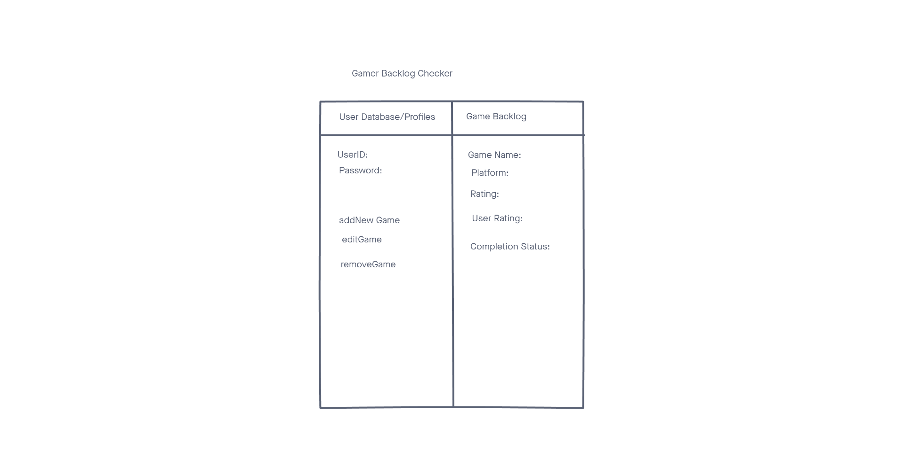
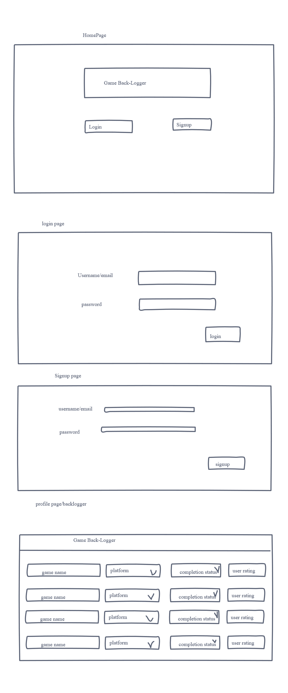
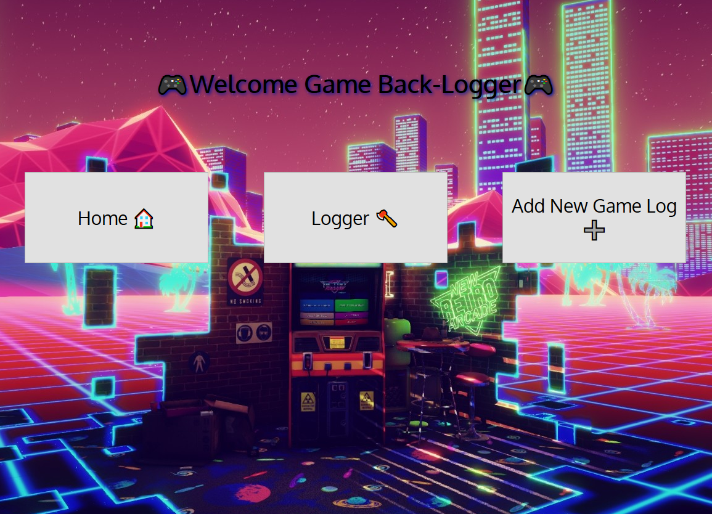
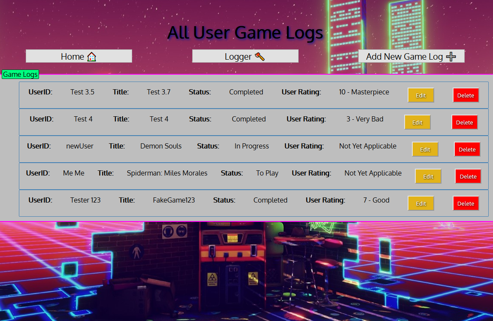
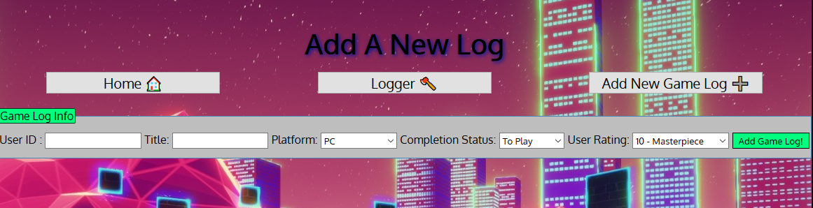
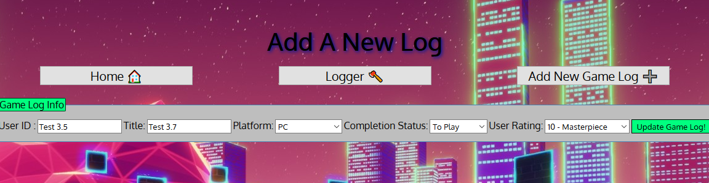

# GameBackLog

Simple web application that adds games to a list to track.

## Technologies

- HTML5
- CSS3
- JavaScript
- Node.js
- Express
- EJS, Embedded JavaScript
- Morgan
- Mongoose
- Method-Override
- MongoDB
- Heroku
- Google Fonts

## Screenshots:
ERD:

Wireframes: 

Actual Site:

Home:

Index:

Add:

Edit:

## Getting Started
[Click Here](https://gamebacklogger.herokuapp.com/) to see the deployed app!

## Future Enhancements
- Add User Signup function
- Personalize database per user login
- Add User Signout function